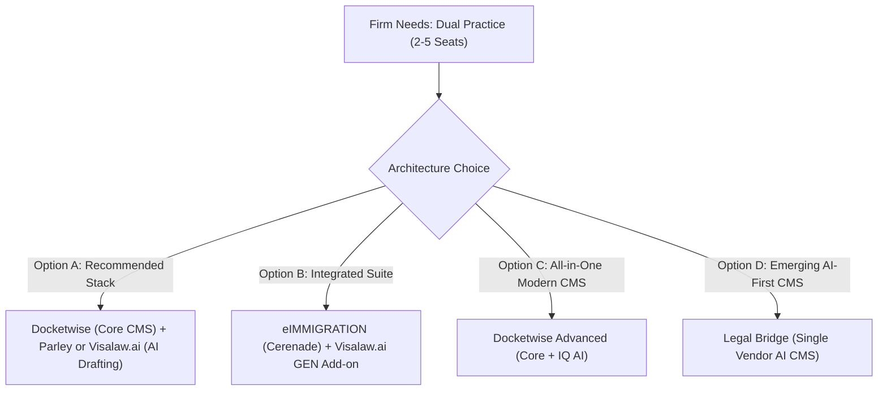
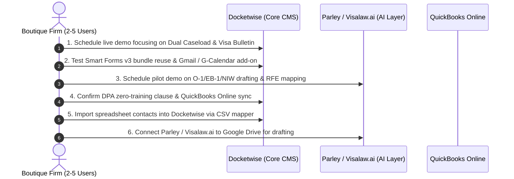

# Ranked Immigration Case Management Recommendations

**Client Profile & Diagnostic Baseline:**
* **Firm Size:** Small boutique practice (2 to 5 total users: attorneys, paralegals, admin)
* **Practice Mix:** Dual focus — Corporate / Employment (H-1B, L-1, PERM, O-1, EB-1/2/3) + Family & Humanitarian (I-130, AOS, K-1, Asylum, VAWA, U/T, TPS)
* **Key Non-Negotiables:** Single-profile form bundle data reuse, direct government e-filing (USCIS, DOL, DOS), automatic USCIS receipt sync, Visa Bulletin tracking (both Filing & Final Action dates), expiration tracking (I-94, EAD, max-outs), granular 4-state document tracking, and Google Workspace / Gmail integration
* **AI & Architecture Strategy:** Highly receptive to a **Best-of-Breed two-tool stack** (rock-solid core CMS + cutting-edge AI drafting & extraction tool), prioritizing document data extraction, petition/support letter drafting, RFE analysis, and heightened confidentiality (8 CFR § 208.6 for asylum, ABA Formal Opinion 512)
* **Financial & Tech Stack:** QuickBooks Online two-way sync required; migrating from spreadsheets/local folders; open budget for demonstrative ROI

---

## Executive Summary & Ranked Top Fits

### Quick Comparison Matrix

| Rank | Solution / Stack | Architecture | Practice Mix Fit | Forms & E-Filing | Visa Bulletin & Expirations | AI Extraction & Drafting | Client Portal & Intake | Estimated Monthly Cost (3 Seats) |
| :---: | :--- | :--- | :---: | :---: | :---: | :---: | :---: | :---: |
| **#1** | **Docketwise (Advanced) + Parley** | **Best-of-Breed Stack** *(CMS + AI Drafting)* | **9.5 / 10** | **9.0 / 10** | **9.5 / 10** | **9.5 / 10** | **9.0 / 10** | ~$327 *(Docketwise)* + Quote *(Parley)* |
| **#2** | **Docketwise (Advanced Tier)** | **All-in-One CMS** *(with Docketwise IQ)* | **9.0 / 10** | **9.0 / 10** | **9.5 / 10** | **7.0 / 10** | **9.0 / 10** | $327/mo ($109/user/mo billed annually) |
| **#3** | **eIMMIGRATION + Visalaw.ai GEN** | **Integrated Partner Stack** | **9.0 / 10** | **9.0 / 10** | **8.5 / 10** | **9.0 / 10** | **8.0 / 10** | ~$255 *(Cerenade)* + $180-$380 *(Visalaw.ai)* |
| **#4** | **Legal Bridge** | **AI-Native Single CMS** | **8.0 / 10** | **7.5 / 10** | **7.0 / 10** | **8.5 / 10** | **8.0 / 10** | Quote / Tiered (Free tier exists) |
| **#5** | **CampLegal** | **Lightweight Core CMS** | **7.0 / 10** | **6.5 / 10** | **4.0 / 10** | **4.0 / 10** | **8.0 / 10** | $297/mo ($99/user/mo) |

---

## Detailed Evaluation of Top Fits

### 1. #1 Ranked: Docketwise (Core CMS) paired with Parley (AI Drafting)
> [!TIP]
> **Why this wins:** For a 2–5 person boutique juggling both employment-based petitions and family/humanitarian cases, no single system excels at both high-volume form bundle e-filing and nuanced AI petition drafting. This two-tool pairing solves every single pain point identified in your interview without compromise.

* **Core CMS: Docketwise (Advanced Tier)**
  * **Forms Engine (§1):** Score 5. Full USCIS, DOS (DS-160, DS-260), DOL (ETA-9089, ETA-9141), and EOIR library. Populates an entire bundle (e.g., I-130, I-485, I-765, I-131, G-28) from a single intake profile. Directly e-files to USCIS, DOL FLAG, and DOS CEAC.
  * **Deadlines & Tracking (§3):** Automatic USCIS receipt number checks. **Score 5 on Visa Bulletin tracking** — the only system verified to track *both* Dates for Filing and Final Action Dates charts.
  * **Client Experience & Communications (§5, §7):** Smart web forms with skip logic, 12 languages (Spanish, Arabic, Haitian Creole, etc.), native two-way SMS messaging, and a maintained Google Workspace / Gmail add-on with two-way Google Calendar sync.
  * **Integrations & Operations (§13, §14):** Native two-way QuickBooks Online integration; built-in payment plans and trust accounting via LawPay.
* **AI Drafting Layer: Parley**
  * **AI Petition Drafting & Letters (§8, §9):** Generates bespoke employer support letters, O-1/EB-1/NIW petition letters, and cover letters directly in editable Word format, trained to match your firm's prior successful filings.
  * **RFE Analysis Engine (§9):** Parses complex RFE notices into discrete legal demands, maps required evidence, and drafts structured rebuttal arguments.
  * **Data Extraction (§8, §9):** Automatically extracts data from passports, I-94s, and prior I-797 notices into structured fields, eliminating duplicate data entry.
  * **Exhibit & Packet Assembly (§8):** Compiles evidence into indexed, bookmarked, USCIS-compliant PDF packets with 1 click.

---

### 2. #2 Ranked: Docketwise (Stand-alone All-in-One)
> [!NOTE]
> If you prefer to start with a single vendor before adding third-party drafting tools, Docketwise Advanced provides 80% of what you need right out of the box.

* **Strengths:** 
  * Transparent pricing ($109/user/month on annual billing).
  * Includes **Docketwise IQ** for automated document data capture from passports, green cards, EADs, and I-94s into forms (§9).
  * Built-in packet assembly in Smart Forms v3 and Word docx templating with merge tags (§8).
  * Unmatched tracking of Visa Bulletin shifts and automatic USCIS stage alerts.
* **Trade-offs / Limitations:**
  * AI is limited to data extraction and note summarization; it does not draft complex O-1/EB-1/NIW petitions or parse RFEs (§9).
  * Does not have a locked immutable filed-version snapshot (§1).

---

### 3. #3 Ranked: eIMMIGRATION (Cerenade) + Visalaw.ai GEN
> [!IMPORTANT]
> **The Veteran Powerhouse:** eIMMIGRATION is one of the most comprehensive immigration engines on the market, and its native commercial partnership with Visalaw.ai makes it a formidable contender.

* **Key Capabilities:**
  * **Forms Coverage (§1):** Over 300 government forms (USCIS, DOL, DOS, EOIR). E-files to USCIS, CEAC, and DOL via a dedicated Chrome extension.
  * **AI Synergy (§9, §13):** Features built-in Extractor AI (passport/ID extraction) and Summarizer AI, plus a **direct in-app integration with Visalaw.ai GEN** for drafting briefs, affidavits, and support letters.
  * **Visa Bulletin & Compliance (§3, §16):** Nightly Visa Bulletin comparisons against Final Action dates; 180-day automated expiration reminders; single-tenant database architecture per customer on Azure.
  * **Financials (§13, §14):** Deep QuickBooks integration and LawPay integration; public transparent pricing ($55, $70, or $85/user/month).
* **Trade-offs / Limitations:**
  * User interface is more legacy and has a steeper learning curve than Docketwise.
  * Lacks native two-way SMS messaging (primarily email-driven).
  * Foreign-national portal is web-based; native apps exist only for caseworkers (§5).

---

### 4. #4 Ranked: Legal Bridge (AI-Native Contender)
> [!TIP]
> A modern startup (founded 2023) attempting to deliver both case management and advanced AI drafting under one roof.

* **Key Capabilities:**
  * Built from scratch around modern LLM workflows; prebuilt workflows for H-1B, O-1, EB-1/2/3, family petitions, and humanitarian cases (asylum, VAWA, U-visa) (§2).
  * Automated DS-160 generation and auto-exhibit list generation with USCIS formatting (§8).
  * Native Gmail and Google Calendar sync; Stripe billing; automated missing-document reminders in the client's preferred language (§7, §13).
  * Published 72-hour security breach notification commitment (§16).
* **Trade-offs / Limitations:**
  * Opaque paid pricing (free tier exists, but full firm pricing is unlisted - §18).
  * Smaller form library and unverified direct USCIS e-filing depth compared to Docketwise or Cerenade.
  * QuickBooks sync is basic; no public API or sandbox (§13).

---

### 5. #5 Ranked: CampLegal
* **Best For:** Solo and small boutique firms prioritizing simplicity, modern aesthetic, and native SMS over complex business workflows.
* **Key Capabilities:** Clean UI; published pricing ($79–$99/user/month); native SMS communication triggers; LawPay and QuickBooks Online integrations (§7, §13, §14).
* **Disqualifying Gaps for Your Firm:** Lacks direct government e-filing (generates PDFs only); no Visa Bulletin tracking; no H-1B 6-year max-out or complex expiration rules; no AI drafting or RFE parsing (§1, §3, §9).

---

## Systems Disqualified for Your Practice Profile

| Vendor | Disqualification Rationale Based on Report Findings |
| :--- | :--- |
| **INSZoom (Mitratech)** | Built for enterprise corporate in-house mobility and high-volume HR desks. Expensive, quote-based, complex setup, weak individual foreign-national portal, lacks humanitarian/asylum workflows and Visa Bulletin sync (§1, §2, §3, §5, §18). |
| **LollyLaw (Paradigm)** | Excellent family workflows, but **completely lacks AI** (scores `NS` across extraction, drafting, summarization, and RFE analysis - §9). No USCIS online e-filing (PDFs + DS-160 only), no Visa Bulletin sync, and acquisition by Paradigm has stalled public changelog velocity since 2023 (§1, §3, §18). |
| **LawLogix Edge (Equifax)** | Legacy enterprise platform with zero public pricing, minimal development since 2019, no AI drafting, and no focus on family/humanitarian or modern client mobile experiences (§1, §5, §9, §18). |
| **Filevine ImmigrationAI** | Massive general litigation enterprise platform with an immigration add-on. Over-engineered and disproportionately expensive for a 2–5 person boutique practice; lacks immigration-native forms automation (§1, §2, §18). |
| **Lawfully Pro** | Case tracking and trend analytics point solution, not a full case management system (no forms engine, no intake questionnaires, no billing) (§1, §2, §14). |
| **OpenSphere** | Direct-to-consumer legal marketplace, not an internal law firm CMS (§At a Glance). |

---

## Confidentiality & Ethics Action Plan (8 CFR § 208.6 & ABA Formal Opinion 512)

Because your caseload includes sensitive **asylum and humanitarian relief**, standard commercial SaaS agreements are legally insufficient:

1. **Mandatory DPA Zero-Training Rider:** Require a written Data Processing Agreement (DPA) explicitly stating that client data, uploaded case files, and prompt inputs will **never** be used to train or fine-tune public or proprietary LLMs (Docketwise, Parley, and Visalaw.ai can provide this under contract).
2. **Asylum Confidentiality Firewalls (8 CFR § 208.6):** Ensure asylum applicants' identifying information is strictly cordoned. If using AI tools for translation or drafting, confirm that document text is processed in ephemerally cached API calls (zero-retention) without logging source text to public cloud buckets.
3. **Audit Trails & Attorney Review:** Under ABA Opinion 512, AI drafts cannot be filed without meaningful human verification. The Docketwise + Parley or Cerenade + Visalaw.ai workflows maintain the attorney as the mandatory editorial gatekeeper prior to PDF generation or e-filing.

---

## Actionable Implementation Roadmap

### Next Steps & Demo Questions to Ask Vendors:
1. **For Docketwise:**
   * *"Walk us through populating an I-130 + I-485 + I-765 + I-131 bundle from one intake. How do derivative family members inherit data?"*
   * *"Demonstrate the live Visa Bulletin sync — how does the system notify staff when a client's priority date becomes current under both Dates for Filing and Final Action Dates?"*
   * *"What are the current capabilities and roadmap of Docketwise IQ for passport and prior I-797 data extraction?"*
2. **For Parley / Visalaw.ai:**
   * *"Show us an actual O-1A or EB-2 NIW support letter drafted from scratch using raw client evidence."*
   * *"Upload a real RFE notice: how does your engine parse the demands and generate the evidence-mapping index?"*
   * *"Can you execute a business associate / ethics rider guaranteeing zero data retention and no LLM training on our asylum and client matter data?"*
