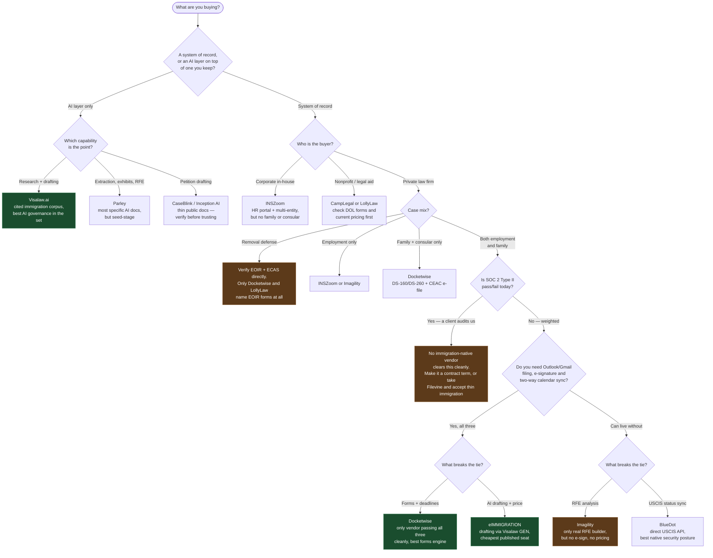
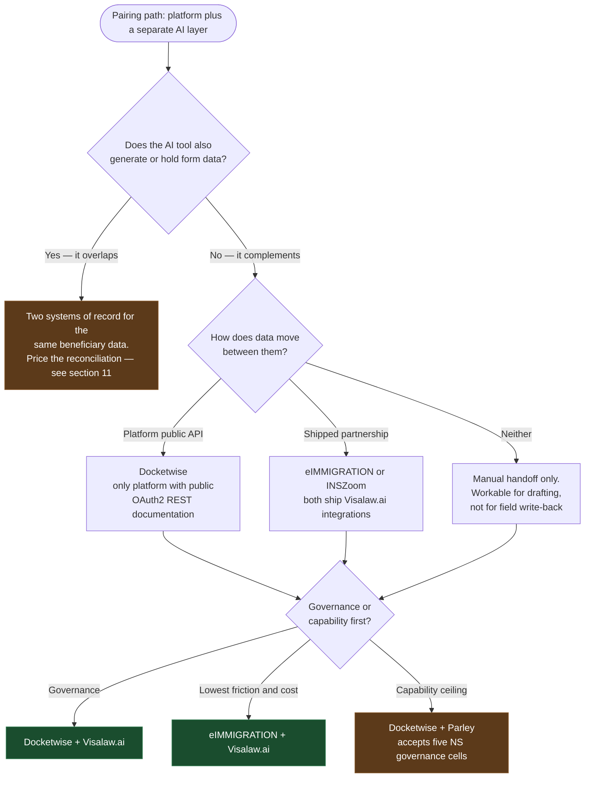

# Ranked CMS Recommendations

**Profile Baseline:**

* **Firm Size:** Small boutique practice (2 to 5 total users: attorneys, paralegals, admin)
* **Practice Mix:** Dual focus — Corporate / Employment (H-1B, L-1, PERM, O-1, EB-1/2/3) + Family & Humanitarian (I-130, AOS, K-1, Asylum, VAWA, U/T, TPS). Case mix is **~70%+ employment**, but the firm’s identity is **O-1 / EB-1 / NIW**, with **H-1B cap as a fire drill**, not the product. Family is the minority and still a hard requirement: **I-130 / I-485 / I-765 / I-131 from one profile**. Petitioners are a **mix of companies and individuals**; both have to feel native.
* **Key Non-Negotiables:** Single-profile form bundle data reuse, direct government e-filing (USCIS, DOL, DOS), automatic USCIS receipt sync, Visa Bulletin tracking (both Filing & Final Action dates), expiration tracking (I-94, EAD, max-outs), granular 4-state document tracking, and Google Workspace / Gmail integration
* **AI & Architecture Strategy:** Highly receptive to a **Best-of-Breed two-tool stack** (rock-solid core CMS + cutting-edge AI drafting & extraction tool), prioritizing document data extraction, petition/support letter drafting, RFE analysis, and heightened confidentiality (8 CFR § 208.6 for asylum, ABA Formal Opinion 512)
* **Financial & Tech Stack:** QuickBooks Online two-way sync required; migrating from spreadsheets/local folders; open budget for demonstrative ROI
* **Hard gates for the system of record:** it must be the case/forms CMS, and it must **e-file to USCIS** (the firm still mails a lot of PDFs). Cap season in the next 90 days means **people, questionnaires, and docs in the system**, not a lottery module.

## Executive Summary & Ranked Top Fits

| Rank | Solution / Stack | Architecture | Practice Mix Fit | Forms & E-Filing | Visa Bulletin & Expirations | AI Extraction & Drafting | Client Portal & Intake | Estimated Monthly Cost (3 Seats) |
| :---: | :--- | :--- | :---: | :---: | :---: | :---: | :---: | :---: |
| **#1** | **Docketwise (Advanced) + Parley** | **Best-of-Breed Stack** *(CMS + AI Drafting)* | **9.5 / 10** | **9.0 / 10** | **9.5 / 10** | **9.5 / 10** | **9.0 / 10** | ~$327 *(Docketwise)* + Quote *(Parley)* |
| **#2** | **Docketwise (Advanced Tier)** | **All-in-One CMS** *(with Docketwise IQ)* | **9.0 / 10** | **9.0 / 10** | **9.5 / 10** | **7.0 / 10** | **9.0 / 10** | $327/mo ($109/user/mo billed annually) |
| **#3** | **eIMMIGRATION + Visalaw.ai GEN** | **Integrated Partner Stack** | **9.0 / 10** | **9.0 / 10** | **8.5 / 10** | **9.0 / 10** | **8.0 / 10** | ~$255 *(Cerenade)* + $180-$380 *(Visalaw.ai)* |
| **#4** | **Legal Bridge** | **AI-Native Single CMS** | **8.0 / 10** | **7.5 / 10** | **7.0 / 10** | **8.5 / 10** | **8.0 / 10** | Quote / Tiered (Free tier exists) |
| **#5** | **CampLegal** | **Lightweight Core CMS** | **7.0 / 10** | **6.5 / 10** | **4.0 / 10** | **4.0 / 10** | **8.0 / 10** | $297/mo ($99/user/mo) |

## How the ranking is weighted

| Weight                | What it does                                                 |
| --------------------- | ------------------------------------------------------------ |
| **Disqualify as CMS** | Not a system of record; no credible USCIS e-file; cannot do a family AOS bundle; implementation is a sales-led project, not weeks |
| **Highest**           | Forms engine + one-profile reuse; USCIS e-file; O-1/EB-1/NIW letters, exhibits, RFEs; drafting that fills forms; Google/Gmail; go-live speed |
| **High**              | Receipt sync inside the CMS; questionnaires + document upload; firm-voice learning; paralegal prepares / attorney revises |
| **Medium**            | SMS; H-1B as structured data not Excel; company + individual intake; exhibit indexes; Visa Bulletin (family AOS + some NIW) |

## Detailed Evaluation of Top Fits

### 1. Docketwise (Core CMS) paired with Parley (AI Drafting)
> [!TIP]
> **Why this wins:** For a 2–5 person boutique juggling both employment-based petitions and family/humanitarian cases, no single system excels at both high-volume form bundle e-filing and nuanced AI petition drafting. This two-tool pairing solves every single pain point identified in your interview without compromise.

* **Why this is #1 rather than a single vendor.** 
  * Docketwise’s own AI is extraction + rewrite. It does **not** draft petition letters or RFEs. Parley is **not** a CMS, has **no e-file**, and is employment-first on family. Split the jobs on purpose: Docketwise owns the matter, family bundles, Google, status, SMS, e-file. Parley owns the premium petition.
* **Core CMS: Docketwise (Advanced Tier)**
  * **Forms Engine (§1):** Score 5. Full USCIS, DOS (DS-160, DS-260), DOL (ETA-9089, ETA-9141), and EOIR library. Populates an entire bundle (e.g., I-130, I-485, I-765, I-131, G-28) from a single intake profile. Directly e-files to USCIS, DOL FLAG, and DOS CEAC.
  * **Deadlines & Tracking (§3):** Automatic USCIS receipt number checks. **Score 5 on Visa Bulletin tracking** — the only system verified to track *both* Dates for Filing and Final Action Dates charts.
  * **Client Experience & Communications (§5, §7):** Smart web forms with skip logic, 12 languages (Spanish, Arabic, Haitian Creole, etc.), native two-way SMS messaging, and a maintained Google Workspace / Gmail add-on with two-way Google Calendar sync.
  * **Integrations & Operations (§13, §14):** Native two-way QuickBooks Online integration; built-in payment plans and trust accounting via LawPay.
* **AI Drafting Layer: Parley**
  * **AI Petition Drafting & Letters (§8, §9):** Generates bespoke employer support letters, O-1/EB-1/NIW petition letters, and cover letters directly in editable Word format, trained to match your firm's prior successful filings.
  * **RFE Analysis Engine (§9):** Parses complex RFE notices into discrete legal demands, maps required evidence, and drafts structured rebuttal arguments.
  * **Data Extraction (§8, §9):** Automatically extracts data from passports, I-94s, and prior I-797 notices into structured fields, eliminating duplicate data entry.
  * **Exhibit & Packet Assembly (§8):** Compiles evidence into indexed, bookmarked, USCIS-compliant PDF packets with 1 click.
* **The integration risk not to paper over.**
  * The report does **not** document a native Docketwise connector. Parley imports from Drive/OneDrive/Dropbox and exports PDF packets. The bar was “round-trip government forms,” which Parley does **inside Parley**. The unproven step is: filled forms + packet → Docketwise matter → Docketwise e-file, without re-keying. That is the first demo script, not a reason to pick a weaker CMS.

### 2. Docketwise (Stand-alone All-in-One)
> [!NOTE]
> If you prefer to start with a single vendor before adding third-party drafting tools, Docketwise Advanced provides 80% of what you need right out of the box. Intake, Smart Forms, e-file, Gmail, status, SMS, and AOS bundles land immediately.

* **Strengths:** 
  * Transparent pricing ($109/user/month on annual billing).
  * Includes **Docketwise IQ** for automated document data capture from passports, green cards, EADs, and I-94s into forms (§9).
  * Built-in packet assembly in Smart Forms v3 and Word docx templating with merge tags (§8).
  * Unmatched tracking of Visa Bulletin shifts and automatic USCIS stage alerts.
* **Trade-offs / Limitations:**
  * Letter drafting and exhibit indexes will still hurt; that is documented in the comparison (drafting **2**, RFE **NS**, exhibit index **NS**). Add Parley or CaseBlink once matters are no longer in spreadsheets.
  * AI is limited to data extraction and note summarization; it does not draft complex O-1/EB-1/NIW petitions or parse RFEs (§9).
  * Does not have a locked immutable filed-version snapshot (§1).

### 3. eIMMIGRATION (Cerenade) + Visalaw.ai GEN
> [!IMPORTANT]
> **The Veteran Powerhouse:** eIMMIGRATION is one of the most comprehensive immigration engines on the market, and its native commercial partnership with Visalaw.ai makes it a formidable contender. This is the only CMS + AI pair in the report that is a **named partnership**. Implementation and one throat to choke are better. Visalaw is strong at letters, briefs, cited research, and summarization, with a written no-train / zero-retention stance.

* **Key Capabilities:**
  * **Forms Coverage (§1):** Over 300 government forms (USCIS, DOL, DOS, EOIR). E-files to USCIS, CEAC, and DOL via a dedicated Chrome extension.
  * **AI Synergy (§9, §13):** Features built-in Extractor AI (passport/ID extraction) and Summarizer AI, plus a **direct in-app integration with Visalaw.ai GEN** for drafting briefs, affidavits, and support letters.
  * **Visa Bulletin & Compliance (§3, §16):** Nightly Visa Bulletin comparisons against Final Action dates; 180-day automated expiration reminders; single-tenant database architecture per customer on Azure.
  * **Financials (§13, §14):** Deep QuickBooks integration and LawPay integration; public transparent pricing ($55, $70, or $85/user/month).
* **Trade-offs / Limitations:**
  *  Visalaw’s forms-engine scores are **1** across the board. eIMMIGRATION Extractor can land passport data in fields; Visalaw still will not round-trip I-129/I-140. 
  * User interface is more legacy and has a steeper learning curve than Docketwise.
  * Lacks native two-way SMS messaging (primarily email-driven).
  * Foreign-national portal is web-based; native apps exist only for caseworkers (§5).

### 4. Legal Bridge (AI-Native Contender)
> [!TIP]
> On **marketing shape** this is the firm: AI-first CMS, **H-1B / O-1 / EB-1 / NIW**, family categories named, claimed **USCIS + DOL FLAG + DOS** e-file, exhibit lists, firm-style drafting, Gmail/Outlook, client portal, missing-doc alerts.

* **Key Capabilities:**
  * Built from scratch around modern LLM workflows; prebuilt workflows for H-1B, O-1, EB-1/2/3, family petitions, and humanitarian cases (asylum, VAWA, U-visa) (§2).
  * Automated DS-160 generation and auto-exhibit list generation with USCIS formatting (§8).
  * Native Gmail and Google Calendar sync; Stripe billing; automated missing-document reminders in the client's preferred language (§7, §13).
  * Published 72-hour security breach notification commitment (§16).
* **Trade-offs / Limitations:**
  * It is not top-three because the comparison cannot verify the non-negotiables: form library is **2** (DS-160 and LCA named, no count), e-file is a claim (**3**), AOS one-profile bundles are not documented, receipt sync is **2**, SMS is absent, help center / support hours / SLA are **NS**, public pricing is not real numbers.
  * Founded 2023, ~80–100 firms claimed.
  * Opaque paid pricing (free tier exists, but full firm pricing is unlisted - §18).
  * Smaller form library and unverified direct USCIS e-filing depth compared to Docketwise or Cerenade.
  * QuickBooks sync is basic; no public API or sandbox (§13).

### 5. eIMMIGRATION + Parley (Alternative CMS stack)
eIMMIGRATION is the other small-firm CMS that is actually **immigration-native, publicly priced, self-serve, and USCIS-e-file capable**. It beats Docketwise on **packet assembly** (merged PDF with contents), **Extractor AI**, **120+ prebuilt processes**, and **Google Drive / Box / Dropbox / OneDrive** (Docketwise has **no** cloud-storage connector in the report). Family coverage is via a large USCIS library rather than named AOS bundles — verify I-130/485/765/131 reuse in the demo.

It ranks under Docketwise because of **this firm’s** priorities, not because it is a worse product in general:

- Status sync is weaker and the mechanism is unstated (**3** vs Docketwise **4**).
- **No SMS** in the report; status **and** texts were wanted inside the CMS.
- E-file is a **Chrome extension**, not documented native e-file. Fine for many firms; org-account online filing is real work here.
- Priority dates: nightly Visa Bulletin, **final action only** — Docketwise tracks both charts.
- Gmail is listed, not a verified Workspace add-on with the same weight as Docketwise’s native add-on.
- Drafting “4” is **Visalaw GEN**, which does **not** fill USCIS forms. “Just Word letters” was already rejected. Parley (or similar) would still sit on top, which is three moving parts unless Visalaw is dropped.

**Pick this over Docketwise** if the demo shows better AOS packet PDFs, Drive as the document spine, and email-only status alerts are acceptable for 90 days.

\----

\----

### 6. Docketwise + CaseBlink — same CMS, narrower and sharper add-on

Same CMS reasons as #1. CaseBlink is the better **identity match** if almost all premium work is **O-1A/O-1B and EB-1A/B/C**: exhibit organization, Studio voice, I-129 named, packet assembly.

It is **#2 rather than #1** because the public form set is narrower than Parley’s, family is absent (so Docketwise must own 100% of AOS), RFE is “draft a response” not “parse requests and map evidence,” and there is **no** Drive import, API, or Gmail bridge in the report. For a Google-first firm that also files NIW and H-1B, Parley covers more of the docket.

**Pick this over Parley if** a CaseBlink demo on a real last EB-1A packet is clearly more usable than Parley, and NIW/H-1B letters can stay in Word for a while.

### 7. Imagility — best “petition machine,” fails the CMS gates on evidence

The most interesting product here and the one I would most want to be wrong about. Imagility is the closest **one-product** match to firm identity: named **O-1, H-1B, EB-1/2/3, I-140**, also **I-130/I-485**, petition scoring, RFE builder, beneficiary profiles, petitioner portal, mobile apps, some cap/bulk talk.

It has the only real RFE Response Builder in the entire comparison (scoring 4 where every other vendor is `NS`) plus petition drafting, and the broadest named case-type coverage across employment *and* family, both scoring 4 ([§2](https://github.com/hbmartin/comparison-immigration-case-management/blob/302cc4cfc57b6bd46ea47f77567d46eb93d2e527/README.md#2-case-type-coverage), [§9](https://github.com/hbmartin/comparison-immigration-case-management/blob/302cc4cfc57b6bd46ea47f77567d46eb93d2e527/README.md#9-ai-capabilities)). That is precisely your tie-breaker profile.

It publishes no pricing, which is hard to reconcile with a one-month timeline. Status sync is manual receipt upload rather than USCIS integration ([§3](https://github.com/hbmartin/comparison-immigration-case-management/blob/302cc4cfc57b6bd46ea47f77567d46eb93d2e527/README.md#3-deadline-and-status-tracking)). Worth a demo specifically to test whether the integration gaps are real or merely undocumented.

It is #7 as **CMS** because USCIS e-file is **2** (directory claim, no form list) and e-file was a kill criterion; case-status is events in the app, **not** USCIS receipt sync; Google is directory-only; admin configuration is **NS**; pricing is contact-sales. That is a poor fit for “live in weeks, no structured system today.”

**Use:** dark-horse demo **if** they can show org-account e-file and a family AOS bundle. Otherwise it is an expensive overlap with Parley/CaseBlink, not a system of record.

### 8. LollyLaw — good small-firm Google CMS, fails the e-file gate

Questionnaires (**4**), contact reuse into forms (**4**), 40 workflows, Gmail add-on, client portal. Family is thin in public docs. **USCIS e-file is NS**; filing is PDF + Chrome DS-160/260. Government e-file was required. Out as primary unless a demo shows USCIS online filing the report missed.

### 9. CampLegal — same story, clearer miss

Credible and honestly priced at $79–$99 per user per month, with e-signature as a workflow action and reasonable coverage across both your practice areas ([§2](https://github.com/hbmartin/comparison-immigration-case-management/blob/302cc4cfc57b6bd46ea47f77567d46eb93d2e527/README.md#2-case-type-coverage), [§8](https://github.com/hbmartin/comparison-immigration-case-management/blob/302cc4cfc57b6bd46ea47f77567d46eb93d2e527/README.md#8-documents-and-evidence), [§18](https://github.com/hbmartin/comparison-immigration-case-management/blob/302cc4cfc57b6bd46ea47f77567d46eb93d2e527/README.md#18-cost-and-vendor-risk)).

**Why not higher:** email capture is `NS` — no Outlook or Gmail filing documented at all, which fails one of your three hard requirements outright. No Visa Bulletin or priority-date tracking, no I-94/EAD expiration tracking, and no SOC 2, ISO or pen-test evidence of any kind ([§3](https://github.com/hbmartin/comparison-immigration-case-management/blob/302cc4cfc57b6bd46ea47f77567d46eb93d2e527/README.md#3-deadline-and-status-tracking), [§15](https://github.com/hbmartin/comparison-immigration-case-management/blob/302cc4cfc57b6bd46ea47f77567d46eb93d2e527/README.md#15-security-posture)).

Milestone CMS, conditional intakes, SMS, public SMB pricing. Filing is **auto-generated PDFs; no online filing evidence (2)**. Out as CMS.

### 10. INSZoom — right for a different buyer

Strongest **corporate / cap-season / LCA / HR** platform in the table. This buyer is a small firm, Google-first, weeks-not-months, **family AOS bundle is a must**, and O-1/EB-1 is the identity. Public family coverage is **NS**. Implementation is Mitratech-shaped, pricing is contact-sales. Cap registration is **not** the 90-day job (people and questionnaires stored is enough). Do not buy this to get off spreadsheets this quarter.

### 11. BlueDot — status toy, not the CMS

Strongest USCIS status sync in the set — a direct government API with overnight automatic checks and email alerts — and the best security posture of any immigration-native vendor here, with SOC 2 Type II stated and unusually specific AI-governance language including a no-training commitment binding its AI providers ([§3](https://github.com/hbmartin/comparison-immigration-case-management/blob/302cc4cfc57b6bd46ea47f77567d46eb93d2e527/README.md#3-deadline-and-status-tracking), [§10](https://github.com/hbmartin/comparison-immigration-case-management/blob/302cc4cfc57b6bd46ea47f77567d46eb93d2e527/README.md#10-ai-governance-and-data-handling), [§15](https://github.com/hbmartin/comparison-immigration-case-management/blob/302cc4cfc57b6bd46ea47f77567d46eb93d2e527/README.md#15-security-posture)).

**Why not higher:** no e-signature and no documented email filing, failing two hard requirements. Thin forms evidence — it claims all USCIS forms but publishes no list, and DOS and DOL coverage is unverified. No consular support found, which matters for your family practice ([§1](https://github.com/hbmartin/comparison-immigration-case-management/blob/302cc4cfc57b6bd46ea47f77567d46eb93d2e527/README.md#1-forms-engine), [§2](https://github.com/hbmartin/comparison-immigration-case-management/blob/302cc4cfc57b6bd46ea47f77567d46eb93d2e527/README.md#2-case-type-coverage)).

### 12. Filevine ImmigrationAI — general PM tax not worth paying

Best public API and security package in the report. Immigration forms **2**, no e-file, **no named case types**, no family, no cap, no HR, implementation is a platform project. This is not a mid-large Filevine shop. Out.

----

### The Agentic Future: Can the platform even hand data over?

Pairing only works if data can move. On the evidence, most of this market cannot:

| Platform       | Public API                                                   | Webhooks / sandbox                                           | Structured export                                            |
| -------------- | ------------------------------------------------------------ | ------------------------------------------------------------ | ------------------------------------------------------------ |
| **Docketwise** | **4** — public OAuth2 REST docs, 10 resources[2](https://github.com/hbmartin/comparison-immigration-case-management/blob/302cc4cfc57b6bd46ea47f77567d46eb93d2e527/RECOMMENDATIONS.md#user-content-fn-dw-s34-47221c4cc60dc730744218093395f136)[3](https://github.com/hbmartin/comparison-immigration-case-management/blob/302cc4cfc57b6bd46ea47f77567d46eb93d2e527/RECOMMENDATIONS.md#user-content-fn-dw-s35-47221c4cc60dc730744218093395f136) | 2 — none documented; Zapier triggers only                    | 3 — CSV of contacts, matters, reports[4](https://github.com/hbmartin/comparison-immigration-case-management/blob/302cc4cfc57b6bd46ea47f77567d46eb93d2e527/RECOMMENDATIONS.md#user-content-fn-dw-s38-47221c4cc60dc730744218093395f136) |
| INSZoom        | 3 — overview article, no endpoint reference                  | 3 — webhooks article, no event list[5](https://github.com/hbmartin/comparison-immigration-case-management/blob/302cc4cfc57b6bd46ea47f77567d46eb93d2e527/RECOMMENDATIONS.md#user-content-fn-iz-s18-47221c4cc60dc730744218093395f136) | 2 — inbound migration only                                   |
| BlueDot        | 2 — priced API, no endpoint docs, but ships an **MCP server**[6](https://github.com/hbmartin/comparison-immigration-case-management/blob/302cc4cfc57b6bd46ea47f77567d46eb93d2e527/RECOMMENDATIONS.md#user-content-fn-bd-s8-47221c4cc60dc730744218093395f136) | `NS`                                                         | 2 — reports and Power BI, no full case export                |
| eIMMIGRATION   | `NS` — API exists, docs on request only                      | `NS`                                                         | 2 — Excel and PDF reports                                    |
| CampLegal      | `NS` — no API, no docs subdomain                             | `NS`                                                         | `NS` — **no structured export documented at all**            |

Two things follow. **Docketwise is the only platform here with genuinely public API documentation**, which makes it the only one you could integrate against without a sales conversation. And **CampLegal has neither an API nor a documented export**, which should rule it out of any pairing strategy — and is worth weighing even for single-vendor use, since you cannot get your data out.

The irony is that the platform with the best API has no announced AI partnership, while the two platforms that *do* ship Visalaw.ai integrations — eIMMIGRATION[7](https://github.com/hbmartin/comparison-immigration-case-management/blob/302cc4cfc57b6bd46ea47f77567d46eb93d2e527/RECOMMENDATIONS.md#user-content-fn-ei-s26-47221c4cc60dc730744218093395f136) and INSZoom — publish no usable API. BlueDot's productized MCP server is the most forward-looking answer to this problem in the set, but its forms score `2` and it has no e-signature ([§1](https://github.com/hbmartin/comparison-immigration-case-management/blob/302cc4cfc57b6bd46ea47f77567d46eb93d2e527/README.md#1-forms-engine), [§8](https://github.com/hbmartin/comparison-immigration-case-management/blob/302cc4cfc57b6bd46ea47f77567d46eb93d2e527/README.md#8-documents-and-evidence)).

## Systems Disqualified for Your Practice Profile

| Vendor | Disqualification Rationale Based on Report Findings |
| :--- | :--- |
| **INSZoom (Mitratech)** | Built for enterprise corporate in-house mobility and high-volume HR desks. Expensive, quote-based, complex setup, weak individual foreign-national portal, lacks humanitarian/asylum workflows and Visa Bulletin sync (§1, §2, §3, §5, §18). |
| **LollyLaw (Paradigm)** | Excellent family workflows, but **completely lacks AI** (scores `NS` across extraction, drafting, summarization, and RFE analysis - §9). No USCIS online e-filing (PDFs + DS-160 only), no Visa Bulletin sync, and acquisition by Paradigm has stalled public changelog velocity since 2023 (§1, §3, §18). |
| **LawLogix Edge (Equifax)** | Legacy enterprise platform with zero public pricing, minimal development since 2019, no AI drafting, and no focus on family/humanitarian or modern client mobile experiences (§1, §5, §9, §18). |
| **Filevine ImmigrationAI** | Massive general litigation enterprise platform with an immigration add-on. Over-engineered and disproportionately expensive for a 2–5 person boutique practice; lacks immigration-native forms automation (§1, §2, §18). |
| **Lawfully Pro** | Case tracking and trend analytics point solution, not a full case management system (no forms engine, no intake questionnaires, no billing) (§1, §2, §14). |
| **OpenSphere** | Direct-to-consumer legal marketplace, not an internal law firm CMS (§At a Glance). |

### Not CMS, ranked only as extras

| Rank                      | Product                     | Role                                                         |
| ------------------------- | --------------------------- | ------------------------------------------------------------ |
| Add-on B                  | **CaseBlink**               | Stack 2. Best O-1/EB-1A specialist.                          |
| Pass as CMS / weak add-on | **Visalaw.ai**              | Letters and research only. Use only if the form-round-trip requirement is dropped. |
| Pass                      | **Inception AI / Formally** | Employment-AI claims, no e-file, no CMS, almost nothing verifiable. |

## What would still move the order

- Proof in demo that **Parley → Docketwise e-file** is painful (then eIMMIGRATION packets, or Legal Bridge-as-CMS, move up).
- **Languages** other than English (Docketwise **5**, eIMMIGRATION **4**; most AI tools **NS**).
- **LCA/FLAG in the CMS** this year (Docketwise documents DOL e-file; it was not required).
- **E-sign in week one** (Docketwise native; left out of the 90-day list).

---

## Primary Decision Tree

This encodes the questions that actually change the answer, in the order they eliminate the most options. It is built from the tables below — every branch is a column you can go verify.

**How to read it.** The SOC 2 branch is the one that surprises people: it is placed before feature tie-breakers because it eliminates on a dimension features cannot compensate for. The three-integration gate sits next because Outlook/Gmail filing, e-signature and two-way calendar sync are each individually common and jointly rare — four otherwise-credible vendors fail on at least one.

## Pairing Decision Tree

### The three pairings

**1. Docketwise + Visalaw.ai — the defensible pair.** The strongest forms engine ([§1](https://github.com/hbmartin/comparison-immigration-case-management/blob/302cc4cfc57b6bd46ea47f77567d46eb93d2e527/README.md#1-forms-engine)) with the only AI vendor here that documents real governance: a privacy policy barring training on queries and outputs[8](https://github.com/hbmartin/comparison-immigration-case-management/blob/302cc4cfc57b6bd46ea47f77567d46eb93d2e527/RECOMMENDATIONS.md#user-content-fn-vl-s6-47221c4cc60dc730744218093395f136), a zero-retention policy backed by a no-retention model API[9](https://github.com/hbmartin/comparison-immigration-case-management/blob/302cc4cfc57b6bd46ea47f77567d46eb93d2e527/RECOMMENDATIONS.md#user-content-fn-vl-s5-47221c4cc60dc730744218093395f136), logical tenant separation, and SOC 2 Type II asserted with ISO/IEC 42001 alignment ([§10](https://github.com/hbmartin/comparison-immigration-case-management/blob/302cc4cfc57b6bd46ea47f77567d46eb93d2e527/README.md#10-ai-governance-and-data-handling), [§15](https://github.com/hbmartin/comparison-immigration-case-management/blob/302cc4cfc57b6bd46ea47f77567d46eb93d2e527/README.md#15-security-posture)). Both publish pricing[10](https://github.com/hbmartin/comparison-immigration-case-management/blob/302cc4cfc57b6bd46ea47f77567d46eb93d2e527/RECOMMENDATIONS.md#user-content-fn-dw-s9-47221c4cc60dc730744218093395f136)[11](https://github.com/hbmartin/comparison-immigration-case-management/blob/302cc4cfc57b6bd46ea47f77567d46eb93d2e527/RECOMMENDATIONS.md#user-content-fn-vl-s3-47221c4cc60dc730744218093395f136). No function overlap. **Cost:** no native integration, so the handoff is manual — tolerable for a drafting workspace, unworkable if you wanted field write-back.

**2. eIMMIGRATION + Visalaw.ai — the low-friction pair.** Already natively integrated, so drafting happens without leaving the case[7](https://github.com/hbmartin/comparison-immigration-case-management/blob/302cc4cfc57b6bd46ea47f77567d46eb93d2e527/RECOMMENDATIONS.md#user-content-fn-ei-s26-47221c4cc60dc730744218093395f136), and part of it sits in the base price. Cheapest platform seat at $55[12](https://github.com/hbmartin/comparison-immigration-case-management/blob/302cc4cfc57b6bd46ea47f77567d46eb93d2e527/RECOMMENDATIONS.md#user-content-fn-ei-s2-47221c4cc60dc730744218093395f136). **Cost:** it fixes the AI governance story while leaving the *platform* governance story weak — Cerenade cites Azure's certifications rather than holding its own SOC 2, and its privacy policy states data is retained indefinitely ([§15](https://github.com/hbmartin/comparison-immigration-case-management/blob/302cc4cfc57b6bd46ea47f77567d46eb93d2e527/README.md#15-security-posture), [§16](https://github.com/hbmartin/comparison-immigration-case-management/blob/302cc4cfc57b6bd46ea47f77567d46eb93d2e527/README.md#16-data-governance-and-portability)). A client security questionnaire will ask about the platform, not only the AI.

**3. Docketwise + Parley — the capability ceiling.** Parley is the only tool in this comparison that parses an RFE into discrete requests and maps each to existing evidence, scoring `4`[13](https://github.com/hbmartin/comparison-immigration-case-management/blob/302cc4cfc57b6bd46ea47f77567d46eb93d2e527/RECOMMENDATIONS.md#user-content-fn-pa-s13-47221c4cc60dc730744218093395f136), with extraction also at `4`[1](https://github.com/hbmartin/comparison-immigration-case-management/blob/302cc4cfc57b6bd46ea47f77567d46eb93d2e527/RECOMMENDATIONS.md#user-content-fn-pa-s15-47221c4cc60dc730744218093395f136). Docketwise's public API makes a real integration buildable. **Cost:** all six AI-governance cells are `NS` ([§10](https://github.com/hbmartin/comparison-immigration-case-management/blob/302cc4cfc57b6bd46ea47f77567d46eb93d2e527/README.md#10-ai-governance-and-data-handling)) — no training commitment, no model disclosure, no retention policy, no tenant isolation, no admin controls — from a YC S24 company with roughly $500K raised and no published pricing[14](https://github.com/hbmartin/comparison-immigration-case-management/blob/302cc4cfc57b6bd46ea47f77567d46eb93d2e527/RECOMMENDATIONS.md#user-content-fn-pa-s21-47221c4cc60dc730744218093395f136). Strong capability, weak paperwork.

### What pairing actually costs

Illustrative, at published rates for a six-person firm, annual billing, licensing the AI tool only to the people who draft:

| Configuration                   | Platform | AI seats | Monthly    |
| ------------------------------- | -------- | -------- | ---------- |
| Docketwise alone                | 6 × $89  | —        | **$534**   |
| Docketwise + 2 × Visalaw Core   | 6 × $89  | 2 × $180 | **$894**   |
| Docketwise + 2 × Visalaw Pro    | 6 × $89  | 2 × $380 | **$1,294** |
| eIMMIGRATION + 2 × Visalaw Core | 6 × $70  | 2 × $180 | **$780**   |

The AI seat costs two to four times the platform seat, so pairing only makes economic sense if it stays narrow. Firm-wide AI licensing roughly triples the bill.
