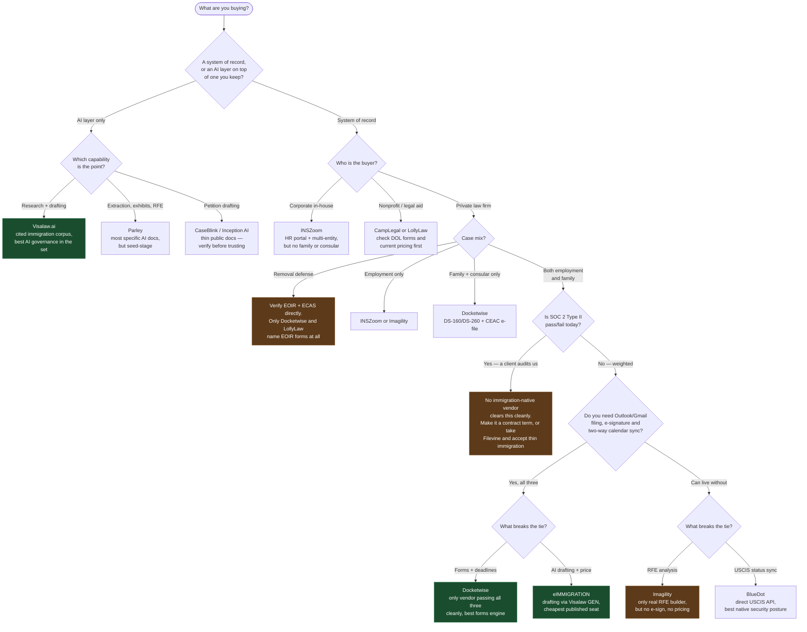
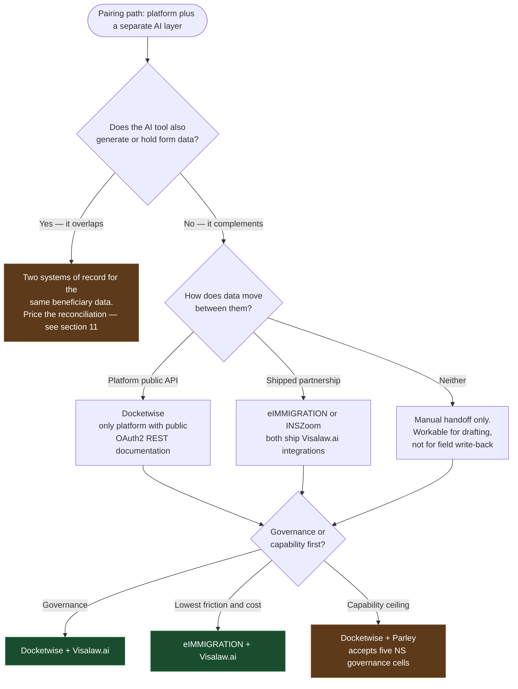

# Recommendations

An applied read of the vendor comparison in **[README.md](README.md)**: a decision tree for narrowing the field, a ranked shortlist worked against one firm profile, and an analysis of pairing a platform with a separate AI layer.

Everything here rests on the scored, cited evidence in the comparison tables, and every claim that points at a table links back to the section carrying it. Read the [method and its limits](README.md#method-and-its-limits) before treating any score as settled: this edition's evidence came from search-engine content extraction rather than direct page retrieval, so scores are capped conservatively and `NS` means *did not surface in search* rather than confirmed absence.

**These are opinions. The comparison is not.** The separation is deliberate — the tables should stay useful to someone whose practice looks nothing like the profile below.

---

## Decision Tree

This encodes the questions that actually change the answer, in the order they eliminate the most options. It is built from the tables below — every branch is a column you can go verify.

**How to read it.** The SOC 2 branch is the one that surprises people: it is placed before feature tie-breakers because it eliminates on a dimension features cannot compensate for. The three-integration gate sits next because Outlook/Gmail filing, e-signature and two-way calendar sync are each individually common and jointly rare — four otherwise-credible vendors fail on at least one.

---

## Ranked Shortlist: Small Mixed-Practice Firm

**The profile this ranking assumes.** Private law firm, 3–10 people, meaningful volume in *both* employment-based and family-based work, replacing spreadsheets and Word templates, wants one system of record with AI drafting preferred but acceptable as a separate product. Hard requirements: Outlook or Gmail email filing, e-signature, two-way calendar sync, and document-collection status tracking. SOC 2 Type II anticipated within a year rather than demanded today. Deciding within a month, so published pricing and self-service onboarding carry real weight. Tie-breakers: forms engine, deadline reliability, AI drafting.

**Re-weight it if your profile differs** — the ranking is a function of those inputs, not an absolute quality ordering. Corporate in-house or removal-defense practices invert much of it.

### 1. Docketwise

The only candidate that passes all three integration requirements on documented evidence: Gmail add-on *and* Outlook add-in that file to a matter, native e-signature with assignable signer fields, and native two-way calendar sync ([§7](README.md#7-communications), [§8](README.md#8-documents-and-evidence), [§13](README.md#13-integrations-and-api)). It also has the best-documented form library in the set — the only one naming USCIS, DOS, DOL *and* EOIR coverage including DS-160, ETA-9089 and ETA-9141 ([§1](README.md#1-forms-engine)) — and the only Visa Bulletin tracking that handles both the Final Action and Dates for Filing charts ([§3](README.md#3-deadline-and-status-tracking)). Published at $69/$89/$109 per user per month ([§18](README.md#18-cost-and-vendor-risk)), which suits a one-month decision.

**What you are accepting:** AI drafting is rewrite-and-translate only, not petition letters or RFE responses ([§9](README.md#9-ai-capabilities)). Document-collection status scores 2 — no evidence of distinct requested/received/reviewed states, which is one of your stated requirements. I-94, EAD and passport expiration tracking returned `NS` ([§3](README.md#3-deadline-and-status-tracking)). Ask about all three in the demo.

### 2. eIMMIGRATION by Cerenade

Very close second, and it wins outright if AI drafting or budget leads. It is the only system of record in this set with genuinely immigration-specific AI drafting — via a native Visalaw.ai GEN integration — alongside Extractor AI mapping passport and PDF data into fields, both scoring 4 ([§9](README.md#9-ai-capabilities)). Cheapest published pricing at $55/$70/$85 per user per month ([§18](README.md#18-cost-and-vendor-risk)), it does track expiration reminders up to 180 days out where Docketwise is silent ([§3](README.md#3-deadline-and-status-tracking)), and its help center is among the deepest here ([§17](README.md#17-implementation-and-onboarding)).

**What you are accepting:** the integration evidence is weaker — Outlook, Gmail and calendar are listed as native but filing-to-matter behaviour is not documented and there is no marketplace listing to corroborate it ([§7](README.md#7-communications), [§13](README.md#13-integrations-and-api)). Document-collection states are `NS`. Two governance findings matter given where you are heading: it cites *Azure's* certifications rather than holding its own SOC 2, and its privacy policy states data is retained indefinitely ([§15](README.md#15-security-posture), [§16](README.md#16-data-governance-and-portability)).

### 3. CampLegal

Credible and honestly priced at $79–$99 per user per month, with e-signature as a workflow action and reasonable coverage across both your practice areas ([§2](README.md#2-case-type-coverage), [§8](README.md#8-documents-and-evidence), [§18](README.md#18-cost-and-vendor-risk)).

**Why not higher:** email capture is `NS` — no Outlook or Gmail filing documented at all, which fails one of your three hard requirements outright. No Visa Bulletin or priority-date tracking, no I-94/EAD expiration tracking, and no SOC 2, ISO or pen-test evidence of any kind ([§3](README.md#3-deadline-and-status-tracking), [§15](README.md#15-security-posture)).

### 4. Imagility

The most interesting product here and the one I would most want to be wrong about. It has the only real RFE Response Builder in the entire comparison — scoring 4 where every other vendor is `NS` — plus petition drafting, and the broadest named case-type coverage across employment *and* family, both scoring 4 ([§2](README.md#2-case-type-coverage), [§9](README.md#9-ai-capabilities)). That is precisely your tie-breaker profile.

**Why it ranks fourth anyway:** it fails all three of your hard integration requirements. No e-signature found at all, email capture and calendar evidenced only through third-party directories with no mechanism described ([§7](README.md#7-communications), [§8](README.md#8-documents-and-evidence), [§13](README.md#13-integrations-and-api)). It publishes no pricing, which is hard to reconcile with a one-month timeline. Status sync is manual receipt upload rather than USCIS integration ([§3](README.md#3-deadline-and-status-tracking)). Worth a demo specifically to test whether the integration gaps are real or merely undocumented.

### 5. BlueDot

Strongest USCIS status sync in the set — a direct government API with overnight automatic checks and email alerts — and the best security posture of any immigration-native vendor here, with SOC 2 Type II stated and unusually specific AI-governance language including a no-training commitment binding its AI providers ([§3](README.md#3-deadline-and-status-tracking), [§10](README.md#10-ai-governance-and-data-handling), [§15](README.md#15-security-posture)).

**Why not higher:** no e-signature and no documented email filing, failing two hard requirements. Thin forms evidence — it claims all USCIS forms but publishes no list, and DOS and DOL coverage is unverified. No consular support found, which matters for your family practice ([§1](README.md#1-forms-engine), [§2](README.md#2-case-type-coverage)).

### Ruled out, and why

| Vendor | Reason |
| ------ | ------ |
| **INSZoom** | No family, consular or Visa Bulletin coverage found, no e-signature, no published pricing. Built for corporate in-house teams — a different buyer than you. |
| **LollyLaw** | No DOL forms named, which rules out PERM and LCA work. No e-signature, no AI of any kind, and a changelog with no entries past 2023. |
| **LawLogix Edge** | No product announcement since 2019, no AI, no pricing, no security evidence. Reads as harvest mode under Equifax. |
| **Filevine** | Best security documentation in the comparison, but immigration case-type coverage is `NS` across employment, family *and* consular. A general platform with a thin bolt-on. |
| **Lawfully Pro, Visalaw.ai, Parley, CaseBlink, Inception AI, Legal Bridge, OpenSphere, Formally** | Not systems of record. Several are strong at what they do — see the pairing note below. |

### The pairing question

You said AI can be a separate product, and that matters here: **no system of record in this set does RFE analysis except Imagility.** If RFE work is real volume for you, the honest answer is a pair, not a single tool.

- **Docketwise + Visalaw.ai** — strongest forms engine with the best-governed AI. Visalaw publishes a no-training commitment, a zero-retention stance and SOC 2 Type II with ISO/IEC 42001 alignment ([§10](README.md#10-ai-governance-and-data-handling), [§15](README.md#15-security-posture)). Adds $180–$380 per user per month, so price it against seats that actually need it.
- **eIMMIGRATION + Visalaw.ai** — already integrated natively, so this is the lowest-friction pairing and part of it is in the base price.
- **Docketwise + Parley** — Parley documents drafting, extraction, exhibit assembly and RFE analysis more specifically than anyone ([§9](README.md#9-ai-capabilities)), but it is YC S24 with roughly $500K raised. You said best product wins; just size the risk.

### The thing that should worry you

Your security requirement is anticipated within a year, and **the immigration-native category is not ready for it.** Every one of the nine systems of record scores `NS` on subprocessor lists ([§16](README.md#16-data-governance-and-portability)). Only BlueDot claims SOC 2 Type II; Docketwise, eIMMIGRATION, INSZoom and Imagility all score 2, meaning a claim without a verifiable report, and four publish nothing at all ([§15](README.md#15-security-posture)).

So whichever you pick, do this during the sales cycle rather than after: ask for the SOC 2 Type II report under NDA and check that it is Type II with a current period, ask for the DPA and a dated subprocessor list with change notification, and get a written no-training commitment covering the vendor's model providers, not just the vendor. Put them in the contract while you still have leverage. If a vendor cannot produce them in a month, that is your answer about what year two looks like.

## Pairing a Platform with a Separate AI Layer

The tables above assume you are buying one product. A second strategy is to buy a strong fundamental platform and a distinct AI drafting and review tool beside it. That is a real option — seven of the seventeen vendors here are AI point solutions rather than systems of record — but it should be chosen on its merits, not drifted into.

When AI moves out of the platform, the platform's own AI scores stop mattering. Docketwise's `2` on drafting ([§9](README.md#9-ai-capabilities)) is irrelevant if you never use it. The platform is then judged on its forms engine, deadlines, integrations and data portability; the AI tool on drafting, extraction and governance. That reshuffles the ranking — and introduces one risk that does not exist in the single-vendor case.

### The test that decides it: complementary, not overlapping

Not every product sold as an "AI layer" is one. Some are partial platforms, and pairing with those recreates precisely the failure this README warns about in [§11](README.md#11-data-model-and-extensibility) — the same fact copied across a questionnaire, a contact record, an I-129 and an I-140 until the copies disagree.

- **Parley extracts passport, I-94 and I-797 data into I-129 and I-140 fields**[^pa-s15]. That is a forms engine. Pair it with a platform and two systems both believe they hold the authoritative beneficiary record.
- **Visalaw.ai does not.** It is research, drafting, summarization and translation sitting beside your forms engine. Its extraction scores `2` ([§9](README.md#9-ai-capabilities)) *because* it does not write structured fields — in a pairing, that is the feature.

So the test is simple: **does the AI tool generate or hold form data?** If yes, you are buying a second system of record, and should price the reconciliation work. If no, you are buying a genuine layer.

### Can the platform even hand data over?

Pairing only works if data can move. On the evidence, most of this market cannot:

| Platform | Public API | Webhooks / sandbox | Structured export |
| -------- | ---------- | ------------------ | ----------------- |
| **Docketwise** | **4** — public OAuth2 REST docs, 10 resources[^dw-s34][^dw-s35] | 2 — none documented; Zapier triggers only | 3 — CSV of contacts, matters, reports[^dw-s38] |
| INSZoom | 3 — overview article, no endpoint reference | 3 — webhooks article, no event list[^iz-s18] | 2 — inbound migration only |
| BlueDot | 2 — priced API, no endpoint docs, but ships an **MCP server**[^bd-s8] | `NS` | 2 — reports and Power BI, no full case export |
| eIMMIGRATION | `NS` — API exists, docs on request only | `NS` | 2 — Excel and PDF reports |
| CampLegal | `NS` — no API, no docs subdomain | `NS` | `NS` — **no structured export documented at all** |

Two things follow. **Docketwise is the only platform here with genuinely public API documentation**, which makes it the only one you could integrate against without a sales conversation. And **CampLegal has neither an API nor a documented export**, which should rule it out of any pairing strategy — and is worth weighing even for single-vendor use, since you cannot get your data out.

The irony is that the platform with the best API has no announced AI partnership, while the two platforms that *do* ship Visalaw.ai integrations — eIMMIGRATION[^ei-s26] and INSZoom — publish no usable API. BlueDot's productized MCP server is the most forward-looking answer to this problem in the set, but its forms score `2` and it has no e-signature ([§1](README.md#1-forms-engine), [§8](README.md#8-documents-and-evidence)).

### The three pairings

**1. Docketwise + Visalaw.ai — the defensible pair.** The strongest forms engine ([§1](README.md#1-forms-engine)) with the only AI vendor here that documents real governance: a privacy policy barring training on queries and outputs[^vl-s6], a zero-retention policy backed by a no-retention model API[^vl-s5], logical tenant separation, and SOC 2 Type II asserted with ISO/IEC 42001 alignment ([§10](README.md#10-ai-governance-and-data-handling), [§15](README.md#15-security-posture)). Both publish pricing[^dw-s9][^vl-s3]. No function overlap. **Cost:** no native integration, so the handoff is manual — tolerable for a drafting workspace, unworkable if you wanted field write-back.

**2. eIMMIGRATION + Visalaw.ai — the low-friction pair.** Already natively integrated, so drafting happens without leaving the case[^ei-s26], and part of it sits in the base price. Cheapest platform seat at $55[^ei-s2]. **Cost:** it fixes the AI governance story while leaving the *platform* governance story weak — Cerenade cites Azure's certifications rather than holding its own SOC 2, and its privacy policy states data is retained indefinitely ([§15](README.md#15-security-posture), [§16](README.md#16-data-governance-and-portability)). A client security questionnaire will ask about the platform, not only the AI.

**3. Docketwise + Parley — the capability ceiling.** Parley is the only tool in this comparison that parses an RFE into discrete requests and maps each to existing evidence, scoring `4`[^pa-s13], with extraction also at `4`[^pa-s15]. Docketwise's public API makes a real integration buildable. **Cost:** all six AI-governance cells are `NS` ([§10](README.md#10-ai-governance-and-data-handling)) — no training commitment, no model disclosure, no retention policy, no tenant isolation, no admin controls — from a YC S24 company with roughly $500K raised and no published pricing[^pa-s21]. Strong capability, weak paperwork.

### What pairing actually costs

Illustrative, at published rates for a six-person firm, annual billing, licensing the AI tool only to the people who draft:

| Configuration | Platform | AI seats | Monthly |
| ------------- | -------- | -------- | ------- |
| Docketwise alone | 6 × $89 | — | **$534** |
| Docketwise + 2 × Visalaw Core | 6 × $89 | 2 × $180 | **$894** |
| Docketwise + 2 × Visalaw Pro | 6 × $89 | 2 × $380 | **$1,294** |
| eIMMIGRATION + 2 × Visalaw Core | 6 × $70 | 2 × $180 | **$780** |

The AI seat costs two to four times the platform seat, so pairing only makes economic sense if it stays narrow. Firm-wide AI licensing roughly triples the bill.

### The argument against pairing

A second vendor doubles your diligence surface: two DPAs, two subprocessor chains, two SOC 2 reports to chase under NDA, two answers when a corporate client asks how generative AI touches their file, and two sets of obligations under [ABA Formal Opinion 512](https://www.americanbar.org/content/dam/aba/administrative/professional_responsibility/ethics-opinions/aba-formal-opinion-512.pdf).

For a firm that expects client security review, that is a real cost and it is easy to underweight next to a capability matrix. The honest summary: **pairing buys materially better drafting and costs a harder compliance story.** Whether that trade is worth it depends on how much RFE and letter-drafting volume you actually have — which is a question about your practice, not about the software.

---

## Sources

Sources for the claims on this page. These are the same citations used in the [comparison tables](README.md), repeated here because Markdown footnotes do not resolve across files. See [method and its limits](README.md#method-and-its-limits) for how they were gathered.

[^dw-s9]: Docketwise — [Help center - Docketwise Pricing](https://support.docketwise.com/en/articles/4731752-docketwise-pricing)
[^dw-s34]: Docketwise — [Public REST API documentation on GitBook](https://docketwise.gitbook.io/docketwise-api-docs)
[^dw-s35]: Docketwise — [Developer / API landing page](https://www.docketwise.com/developers/)
[^dw-s38]: Docketwise — [Help center - Export Contacts and Matters](https://support.docketwise.com/en/articles/4731872-export-contacts-and-matters)

[^ei-s2]: eIMMIGRATION (Cerenade) — [Pricing page](https://get.eimmigration.com/pricing)
[^ei-s26]: eIMMIGRATION (Cerenade) — [AI tools capability page](https://get.eimmigration.com/capabilities/ai-tools)

[^iz-s18]: INSZoom (Mitratech) — [Help - Zoom Webhooks](https://success.mitratech.com/INSZoom/Help_Articles/Support/Zoom_Webhooks)

[^bd-s8]: BlueDot — [API Pricing page](https://bdot.ai/pricing-api)

[^vl-s3]: Visalaw.ai — [Pricing page - Core, Pro, Enterprise tiers](https://www.visalaw.ai/pricing)
[^vl-s5]: Visalaw.ai — [Security page - SOC 2, SSO, audit logs, subprocessors](https://www.visalaw.ai/security)
[^vl-s6]: Visalaw.ai — [Privacy policy - Visalaw Ventures Inc dba Visalaw AI](https://www.visalaw.ai/privacy-policy)

[^pa-s13]: Parley — [RFE Analyzer product page](https://ai.parley.so/rfe-analyzer-targeted-responses)
[^pa-s15]: Parley — [Auto-fill USCIS forms page](https://ai.parley.so/auto-fill-uscis-forms-passport-i94-i797)
[^pa-s21]: Parley — [Y Combinator S24 company listing](https://www.ycombinator.com/companies/parley)
